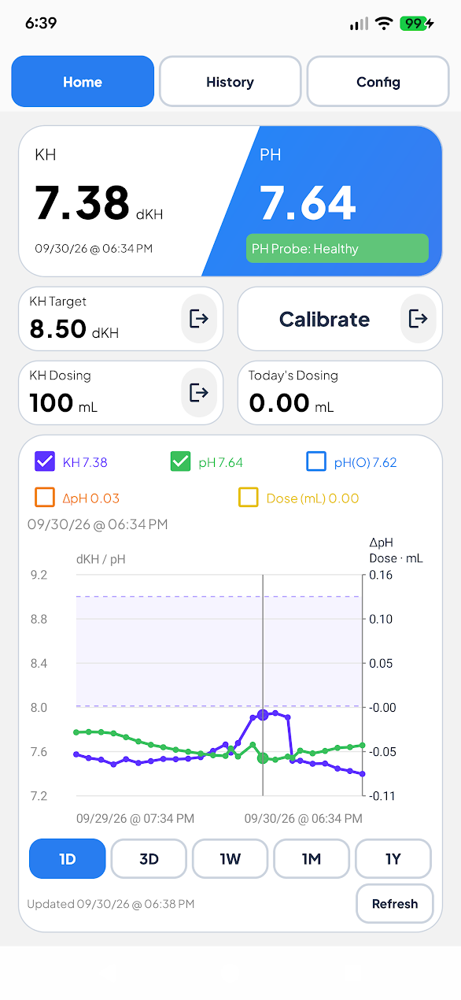
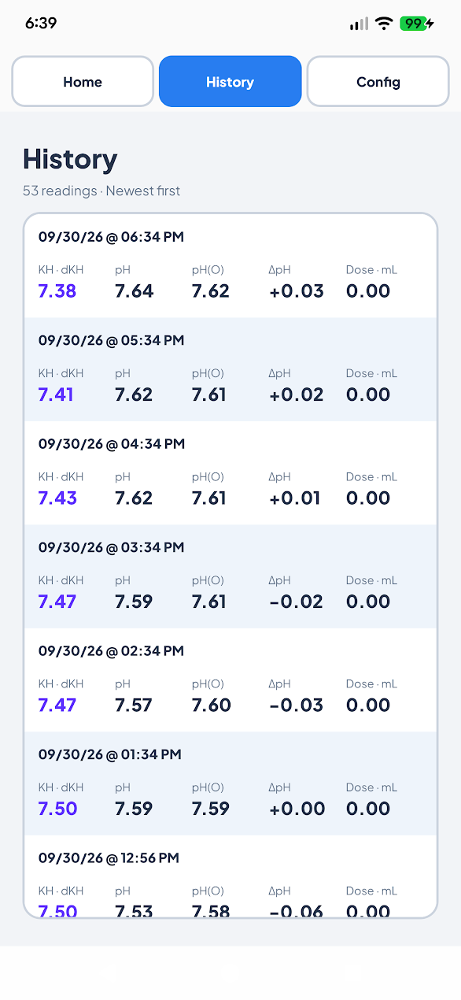
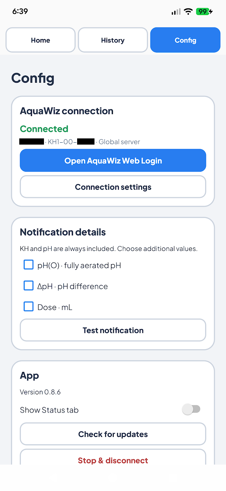
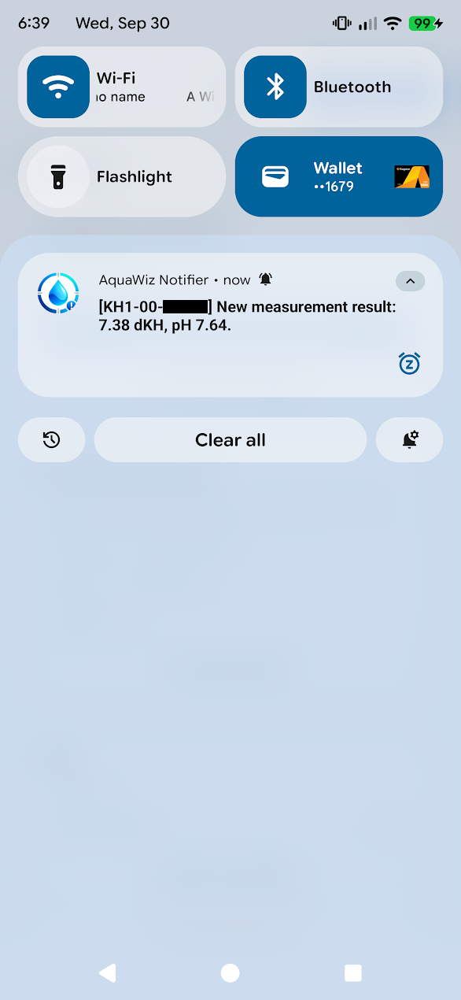

# AquaWiz Notifier

Unofficial, open-source Android companion for AquaWiz KH controllers. AquaWiz Notifier signs into the AquaWiz cloud, checks for new measurements, and creates a normal Android notification for **every newly detected measurement**, not only readings outside AquaWiz's email-alert thresholds.

**Made by Biff0rz.** Find me on [Reef2Reef](https://www.reef2reef.com/members/biff0rz.154703/).

Project: [github.com/stevestokes/AquaWizNotificationsApp](https://github.com/stevestokes/AquaWizNotificationsApp)

> Not affiliated with or endorsed by AquaWiz. This project uses an undocumented interface recovered from the publicly distributed AquaWiz Android APK. AquaWiz may change that interface at any time.

## Download

[**Download the latest AquaWiz Notifier APK**](https://github.com/stevestokes/AquaWizNotificationsApp/releases/latest/download/AquaWizNotifier.apk)

Android only. This is a sideloaded APK. On first install, Android may ask you to allow installs from your browser or file manager.

[View all releases](https://github.com/stevestokes/AquaWizNotificationsApp/releases)

## Screenshots

Account names and device ID suffixes are redacted.

| Home | History |
|:---:|:---:|
|  |  |

| Config | Notification |
|:---:|:---:|
|  |  |

## Features

- Android notification for every newly detected AquaWiz measurement.
- Alkatronic-style measurement notification:
  - `[KH1-00-XXXXX] New measurement result: 8.42 dKH, pH 8.27.`
- Optional inline details:
  - `pH(O) 8.35 • ΔpH -0.08 • Dose 1.20 mL`
- Individual on/off controls for pH(O), ΔpH, and Dose.
- Adaptive polling anchored to the controller's actual measurement timestamp.
- Encrypted AquaWiz account/token storage using Android Keystore.
- Background polling never auto-logs in after an AquaWiz session rejection; monitoring pauses instead to avoid disrupting the official AquaWiz app session.
- Four-section app UI: **Home**, **Status**, **History**, and **Config**.
- Persistent, auto-scrolling activity/diagnostic log in the Status tab.
- Local measurement History stores every retrieved measurement and all available values regardless of notification-display settings.
- Global and China AquaWiz server support.
- GitHub Releases update checker with an Android notification when a newer app version is available.
- Manual **Check for updates** button.
- Test notification uses the most recent real stored measurement when available; before the first real reading it uses one of several normal sample measurements.
- GitHub and Reef2Reef links directly in the app.
- Measurement notifications open the installed official AquaWiz app when tapped; if AquaWiz is not installed, AquaWiz Notifier opens instead.
- Custom white/blue AquaWiz Notifier launcher icon for the public build.

## AquaWiz Web Login and bearer-token authentication

Version 0.8.3 uses **AquaWiz Web Login** as the only authentication path, opening it automatically when no session is saved. Real-device testing confirmed that AquaWiz Notifier can poll with a web-issued AquaWiz bearer token while the official AquaWiz mobile app remains logged in and functional.

The flow opens the official AquaWiz website inside an in-app WebView. AquaWiz itself handles the username/password form. AquaWiz Notifier captures only the returned `access_token`, validates it by reading the latest measurement, stores it encrypted with Android Keystore, and then polls normally.

Manual token entry and direct credential login have been removed. Existing saved tokens migrate without forcing another login, and old stored passwords are removed. Android sandboxing prevents AquaWiz Notifier from reading the installed AquaWiz app's private Expo SecureStore directly, so Web Login is the clean handoff path without root or cooperation from the official app.

## AquaWiz session behavior

Real-device testing confirmed that the official AquaWiz mobile app can remain logged in while AquaWiz Notifier polls with a separate token issued by the AquaWiz website. Background polling still **does not automatically re-authenticate** after a `401` or `403` response; it pauses and waits for the user to reconnect.

If AquaWiz rejects the notifier token, monitoring pauses and the app records the condition in Status. The recommended recovery is to reconnect through **AquaWiz Web Login**.

## Measurement timing

With the default 60-minute controller interval, a measurement timestamped `T` causes future checks to become eligible at approximately:

- `T + 17m`
- `T + 32m`
- `T + 47m`
- `T + 62m`

The fourth check is two minutes after the next expected hourly result. If a new result appears during any earlier check, the schedule is immediately re-anchored to that result's own AquaWiz timestamp.

If no new result exists at `T+62`, the app continues in 15-minute steps: `T+77`, `T+92`, etc.

Android can defer WorkManager jobs during Doze, standby, or OEM battery optimization, so these are **earliest eligible times**, not real-time guarantees.

## AquaWiz API mapping

The key request contracts recovered from the official Android APK are:

### Official website login contract

This is reference information recovered from AquaWiz; the notifier no longer calls this endpoint.

```http
POST https://server.aquawiz.net/api/v1/KH/auth
Content-Type: application/json

{
  "user": "<username>",
  "password": "<password>",
  "token": {
    "access_token": ""
  }
}
```

The successful response contains an AquaWiz access token. Authenticated requests use:

```http
Authorization: Bearer <access_token>
```

### Current device data

```http
POST https://server.aquawiz.net/api/v1/KH/{DEVICE_SERIAL}/all_field
Authorization: Bearer <access_token>
Content-Type: application/json

{
  "user": "<username>",
  "token": {
    "access_token": "<access_token>"
  }
}
```

The device serial, not the username, belongs in the route.

Important current-value fields used by the official AquaWiz client include:

- `latest_kh` — current KH
- `latest_ph` — pH probe/status field, **not the displayed pH**
- `latest_ph1` — displayed tank pH
- `latest_time` — measurement timestamp

### Graph/history fallback

```http
GET https://server.aquawiz.net/api/v1/query/device/{DEVICE_SERIAL}/graph?date={ISO-8601}
Authorization: Bearer <access_token>
```

For KH-series graph rows, the official app transforms these raw fields:

| Raw field | Meaning | Official transform |
| --- | --- | --- |
| `field22` | dKH | value / 1000 |
| `field26` | Dose (mL) | value / 5000 |
| `field27` | Tank pH | value / 1000 |
| `field28` | pH(O), fully aerated pH | value / 1000 |
| derived `delta` | ΔpH | pH - pH(O) |

See [docs/API_REVERSE_ENGINEERING.md](docs/API_REVERSE_ENGINEERING.md) for the detailed reverse-engineering notes.

## App sections

### Home

AquaWiz-style dashboard with current KH/pH, dosing summary, a **Take me to the AW app** shortcut, and an interactive KH/pH/pH(O) chart. Range buttons (`1D`, `3D`, `1W`, `1M`, `1Y`) fetch the official AquaWiz graph endpoint using the existing bearer token and merge those points into local History. The chart uses a single Y axis with tight bounds around the target range and every enabled data line, with 0.2 outer padding. Toggle KH, pH, pH(O), ΔpH, and Dose independently. Long press a legend item for solid, dashed, or dotted lines. Visibility, styles, and the selected range are saved locally. Drag to inspect, pinch to zoom, and double tap to reset.

### Status

Shows live monitoring state, current version/update state, latest stored measurement, polling schedule, errors, and the rolling activity log. The live status console auto-scrolls to the newest entry.

### History

Displays alternating newest-first rows with KH, pH, pH(O), ΔpH, and Dose directly visible. Measurements are stored locally. History is independent of notification configuration: dKH, pH, pH(O), ΔpH, Dose, device serial, and measurement timestamp are retained whenever those values are available from AquaWiz. The initial baseline reading is stored in History even though it intentionally does not produce a notification.

### Config

Contains AquaWiz login/server/device settings, measurement interval, notification-detail toggles, test notification, update check, and sign-out controls. When no session is saved, the app opens Web Login automatically; valid configured sessions open Home.

## Setup

1. Install the APK on Android.
2. Allow notifications.
3. Select the AquaWiz Global or China server.
4. Sign in on the official AquaWiz page in **Open AquaWiz Web Login**.
5. Enter the controller serial if it is not discovered automatically.
6. Leave the measurement interval at 60 minutes unless your controller is configured differently.
7. Choose which optional notification fields to show.
8. Tap **Test notification**.
9. Complete Web Login and any requested account/controller identifiers to start monitoring.

The first successfully read measurement becomes the baseline and does **not** create an old/stale notification. It is still saved to local History. The next new measurement notifies normally.

## Activity / diagnostics

The Status tab contains a fixed-height scrollable activity console. New entries are appended at the bottom and the view automatically scrolls to the newest information.

The activity log records events such as:

- AquaWiz sign-in attempts/results
- background measurement checks
- baseline establishment
- new measurement notifications
- API/network errors
- GitHub update checks
- available app updates

A rolling history of up to 5,000 entries is kept locally.

## App updates

AquaWiz Notifier uses the public GitHub Releases API:

```text
GET https://api.github.com/repos/stevestokes/AquaWizNotificationsApp/releases/latest
```

The app checks:

- when the app opens, if it has not checked recently
- once every 24 hours in the background
- whenever **Check for updates** is tapped

When a newer semantic version is found, Android displays an update notification. Tapping it opens the GitHub Release page.

The repository must be **public** and have at least one published GitHub Release for the unauthenticated updater to work. No GitHub token is embedded in the APK.

## Versioning and release signing

Every installable release must increment:

```kotlin
versionCode = 15
versionName = "0.8.6"
```

Future releases must use the **same Android signing key**. Otherwise Android will reject the new APK as an update to the installed app.

The tagged-release workflow expects these GitHub Actions secrets:

- `AQUAWIZ_KEYSTORE_BASE64`
- `AQUAWIZ_KEYSTORE_PASSWORD`
- `AQUAWIZ_KEY_ALIAS`
- `AQUAWIZ_KEY_PASSWORD`

A tag such as `v0.8.3` builds a signed release APK and publishes two release assets: `AquaWizNotifier.apk` for the permanent latest-download link and `AquaWizNotifier-v0.8.3.apk` for versioned archives.

Do not lose the release keystore. If it is lost, existing users cannot install future APKs as normal upgrades.

## Build

Requirements:

- JDK 17
- Android SDK Platform 36
- Android Build Tools 36.0.0

Development build:

```bash
./gradlew testDebugUnitTest assembleDebug
```

or:

```bash
./scripts/verify.sh
```

Debug APK:

```text
app/build/outputs/apk/debug/app-debug.apk
```

The repository currently uses Android Gradle Plugin 9.4.0, Gradle 9.6.0, and WorkManager 2.12.0.

## Security

AquaWiz account identifiers and cloud token are stored in an AES-GCM encrypted blob protected by a non-exportable Android Keystore key. Android backup is disabled.

The project does not operate its own backend, notification relay, analytics service, or crash collector.

See [SECURITY.md](SECURITY.md).

## Support

If AquaWiz Notifier is useful to you and you'd like to give something back, please consider donating to the **Cystic Fibrosis Foundation** instead of buying me a coffee or sending anything to me personally.

Cystic fibrosis (CF) is a genetic disease that affects the lungs, digestive system, and other organs by causing thick, sticky mucus to build up in the body. It is a lifelong condition that can lead to serious respiratory and nutritional complications. CF has impacted my family, so I'd much rather see support for the people and research fighting this disease than receive a donation for my work on this app.

[**Donate to the Cystic Fibrosis Foundation**](https://www.cff.org/donate)

If possible, please donate **in honor of Kaylee Stokes, Michigan Chapter**.

## License

MIT. See [LICENSE](LICENSE).


## 0.8.0 Home and chart update

Home follows the official AquaWiz diagonal summary card, rounded tiles, and Plus Jakarta Sans fonts. Current device settings supply the KH target, probe state, and remaining solution. History is compact, chart preferences persist locally, and all displayed dates use `MM/dd/yy @ hh:mm AM/PM` in the device timezone.

## 0.8.1 Layout polish

Home titles, values, units, and footer rows align consistently. All Home cards share a darker 2dp border. Graph range controls use rounded selection buttons, while tight 0.2-padded bounds keep target limits and enabled lines visible, including readings outside the target range. History shows all five values in alternating rows without a detail dialog. Config groups connection state, notification toggles, and app actions; connection editors expand when needed. Tab order is Home, History, Status, Config.

## 0.8.3 Notifications and unit alignment

Measurement notifications use one bold text block, with selected optional fields inline and no manually formatted date. Android shows the time the notification was posted. Each controller/timestamp has a unique notification tag, so new results accumulate as individual notifications until opened or dismissed; repeat delivery of the same reading updates only that reading. Android may group the individual notifications automatically. Home units sit beside their numeric values on the same baseline.

### APK updates

Download `AquaWizNotifier-signed` from a successful push CI run. Installable builds and tagged releases use the same persistent `AQUAWIZ_KEYSTORE_*` secrets (including `AQUAWIZ_KEY_ALIAS` and `AQUAWIZ_KEY_PASSWORD`). Never regenerate or rotate this key for ordinary updates. Android requires the same application ID and signing certificate, plus a non-decreasing version code. The runner-generated debug APKs distributed through v0.8.2 used different keys; switching those installations to the release key requires one final uninstall/install. Uninstalling clears local app data, so reconnect and restore preferences afterward. Future signed updates preserve them. CI intentionally does not distribute debug APKs.
